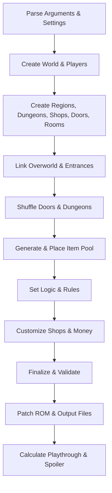

# Main Algorithm Flow: Randomizer Orchestration (`Main.py`)

This document provides a detailed breakdown of the main orchestration flow in [`Main.py`](../../Main.py), describing how the randomizer initializes, coordinates modules, and produces output.

## High-Level Steps

1. **Argument and Settings Initialization**
   - Parse CLI/GUI arguments and options.
   - Load customizer YAML if provided.
   - Set up random seed and world configuration.

2. **World and Player Setup**
   - Create the `World` object with all settings.
   - Initialize player-specific options (difficulty, logic, item pool, etc.).
   - Assign precollected items and starting inventory.

3. **Module and Data Structure Creation**
   - Create regions, dungeons, shops, doors, and rooms for each player.
   - Place bosses and randomize enemies.
   - Adjust locations and initialize data tables.

4. **Overworld and Entrance Linking**
   - Link overworld regions and entrances.
   - Handle dynamic exits and entrance shuffling.

5. **Door and Dungeon Shuffling**
   - Prepare and link doors using selected algorithms.
   - Mark light/dark world regions.
   - Record door configuration if needed.

6. **Item Pool Generation and Placement**
   - Generate the item pool for each player.
   - Verify and massage item pool configuration.
   - Place dungeon prizes and items using selected algorithms.

7. **Logic and Rule Setup**
   - Set access rules and logic for all locations.
   - Configure district item pools and dungeon tracking.

8. **Shop and Money Logic**
   - Customize shops and sell keys/potions as needed.
   - Balance money progression.

9. **Finalization and Validation**
    - Ensure the world is beatable.
    - Perform sanity checks and validation.

10. **ROM Patching and Output**
    - Patch ROM(s) or create BPS patches.
    - Output ROM files, spoiler logs, and multidata for multiworld.

11. **Playthrough and Spoiler Generation**
    - Calculate playthrough spheres and required items.
    - Generate spoiler logs and walkthroughs.

## Mermaid Diagram: Main Flow

## Key Functions and Modules

- [`main()`](../../Main.py:59): Orchestrates the entire process.
- [`World`](../../BaseClasses.py): Central data structure for game state.
- [`create_regions`](../../Regions.py), [`create_dungeons`](../../Dungeons.py), [`create_doors`](../../Doors.py), [`link_doors`](../../DoorShuffle.py): Core setup and shuffling.
- [`generate_itempool`](../../ItemList.py), [`fill_dungeons_restrictive`](../../Fill.py): Item pool logic.
- [`set_rules`](../../Rules.py): Logic and access rules.
- [`patch_rom`](../../Rom.py): ROM patching and output.
- [`create_playthrough`](../../Main.py:687): Playthrough and spoiler generation.

## Notes

- The flow is highly modular, with each step invoking specialized modules for logic, item placement, and patching.
- Multiworld and multiplayer logic is integrated throughout.
- Customization and extensibility are supported via YAML, presets, and modular architecture.
